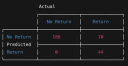
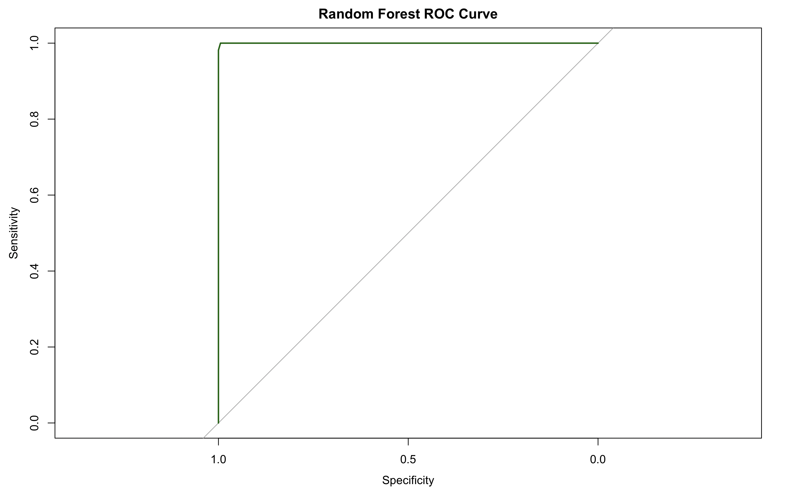

# Machine Learning Model for Predicting Product Returns in E-Commerce

## Overview
This project builds a Random Forest machine learning model to predict whether a purchased product will be returned based on customer behavior data.

## Dataset
The dataset contains simulated e-commerce customer usage data including:

- UsageDuration
- CustomerSatisfactionScore
- Category
- Region
- PurchaseAmount
- WarrantyStatus
- ReturnFlag (target)

## Model
Algorithm used:
- Random Forest (500 trees)

## Results

Accuracy: **95.83%**  
AUC Score: **0.9999**

## Model Performance

### Confusion Matrix

### ROC Curve

## Technologies
- R
- randomForest
- caret
- pROC
- ggplot2

## Author
Shaik Naved Ahmed
